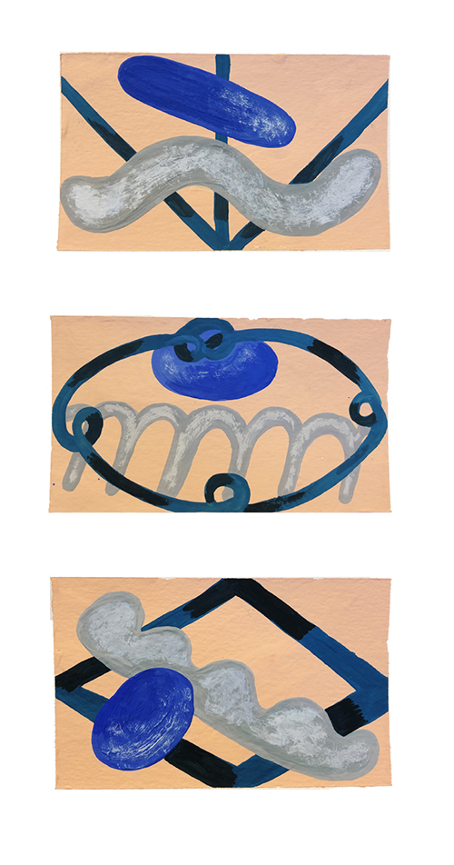

---
# Feel free to add content and custom Front Matter to this file.
# To modify the layout, see https://jekyllrb.com/docs/themes/#overriding-theme-defaults

layout: default-neue

---
[⬅ back](index)

# 3 shapes

One shape touching all frame edges

One ellipse

One shape extending horizontally

  
