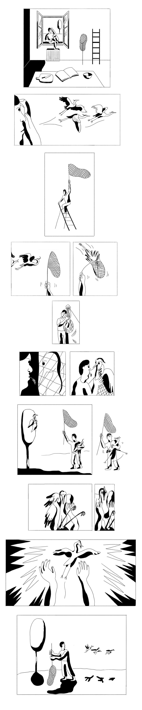

---
# Feel free to add content and custom Front Matter to this file.
# To modify the layout, see https://jekyllrb.com/docs/themes/#overriding-theme-defaults

layout: page

---
[☜ back to work](narratives)  
# a bird in the hand

A visual interpretation of a popular saying: how can a single, lossy sentence generate a rich visual story?

  
