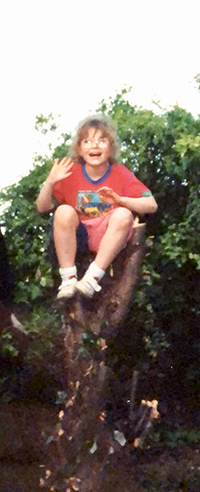

---
# Feel free to add content and custom Front Matter to this file.
# To modify the layout, see https://jekyllrb.com/docs/themes/#overriding-theme-defaults

layout: default-neue

---

# About 

I'm a designer and illustrator living in London. I create experimental stories, and aim for a mood of absurdity which nevertheless feels emotionally resonant. I also make paintings and drawings.

I'm always interested in illustration commissions and collaborations. Get in touch!

* MA Visual Communication, Royal College of Art
* MSc Human-Computer Interaction, University College London
* BA Design for Graphic Communication, University of Reading

[rapturebird on Instagram](http://instagram.com/rapturebird), r.e.cottrell ✺ gmail.com  

  
