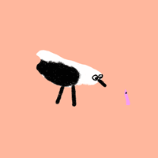

---
# Feel free to add content and custom Front Matter to this file.
# To modify the layout, see https://jekyllrb.com/docs/themes/#overriding-theme-defaults

layout: default-neue
title: About

---

# about

I make pictures and short experimental comics, with an interest in absurdity, dreams, and story rules. My major project at the RCA used a recurring plot about [a fly who dies in every story](rca-notes). I'm also interested in applying ideas in computing to ways of making stories and art.

Get in touch: r.e.cottrell ✺ gmail.com

See recent work on [Instagram](http://instagram.com/rapturebird)

  

## Exhibitions + events

* Ghost Comics Festival, Glasgow, October 2019
* SHOW 2019, Royal College of Art, July 2019
* Work In Progress Show, Royal College of Art, February 2019
* Proof, Royal College of Art, January 2019
* Guilty Pleasures, ASP4, ICA, December 2018
* Dance of Life, Church Street Library, October 2018
* Common Market, Royal College of Art, April 2018
* The Reader, Tenderbooks, April 2018

## Education

* MA Visual Communication, Royal College of Art (2019)
* MSc Human-Computer Interaction, University College London (2010)
* BA Design for Graphic Communication, University of Reading (2007)
