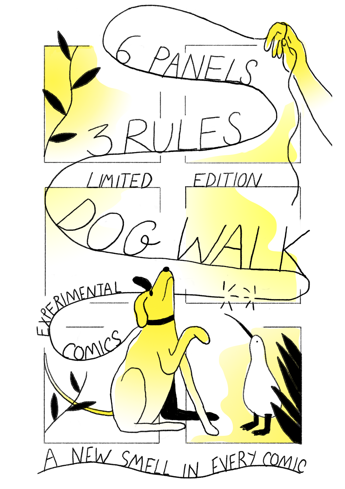
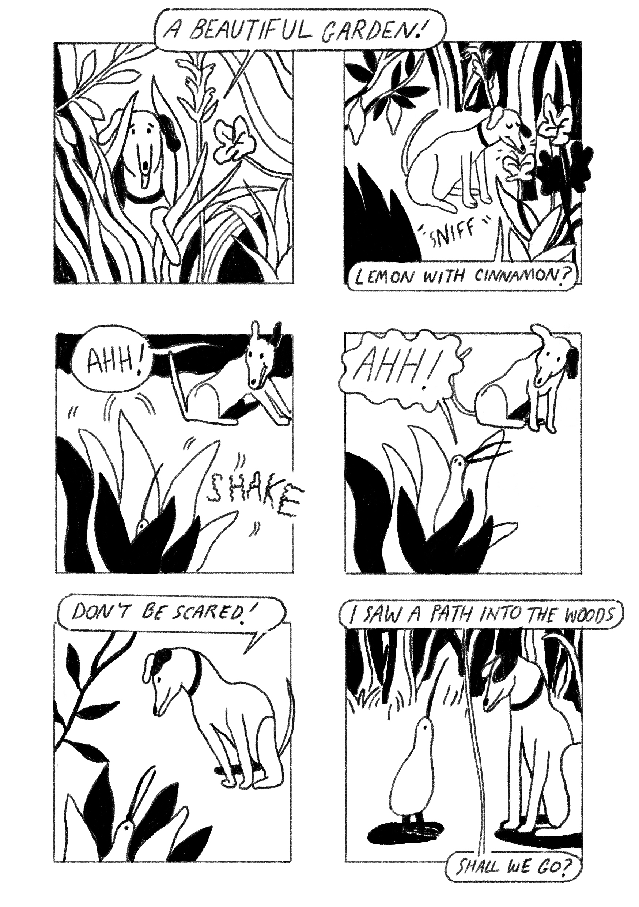

---
# Feel free to add content and custom Front Matter to this file.
# To modify the layout, see https://jekyllrb.com/docs/themes/#overriding-theme-defaults

layout: page

---
[☜ back to work](narratives)  
# dog walk

Dog Walk is a collaborative experiment into narrative comics, storytelling and structured remixes.

Over six panels, a dog goes for a walk, makes a positive observation, meets a kiwi bird, and experiences a new and interesting smell. The final panel ends with a cliffhanger.

Artists were invited to contribute their own version of the story following these rules.

  

