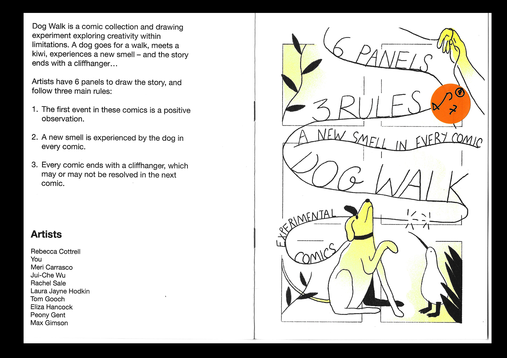

---
# Feel free to add content and custom Front Matter to this file.
# To modify the layout, see https://jekyllrb.com/docs/themes/#overriding-theme-defaults

layout: default-neue

---

[⬅ back](index)

# Dog Walk

[Buy this comic in the shop](http://rapturebird.bigcartel.com). 

An experimental comic collection created in 2018, featuring the work of 9 Royal College of Art artists. Riso printed by Hato Press.

The stories are created over six panels using the following rules:

1. The first event in these comics is a positive observation.
2. A new smell is experienced by the dog in every comic.
3. Evert comic ends with a cliffhanger, which may or may not be resolved in the next comic.

Rebecca Cottrell
Meri Carrasco
Jui-Che Wu
Rachel Sale
Laura Jayne Hodkin
Tom Gooch
Eliza Hancock
Peony Gent
Max Gimson

If you're outside the UK, get in touch with me so I can work out a fair shipping cost: r.e.cottrell@gmail.com

  
