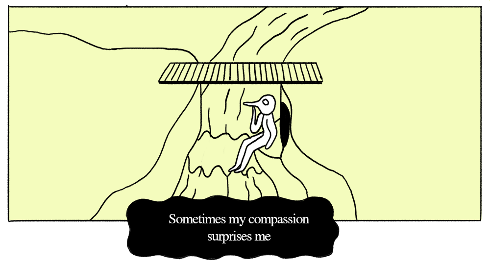

---
# Feel free to add content and custom Front Matter to this file.
# To modify the layout, see https://jekyllrb.com/docs/themes/#overriding-theme-defaults

layout: default

---

# Indeterminacy comics

  

## The river and the bird-monster
A comic strip about a bird-like monster who lives under a bridge. In every strip, the monster encounters someone (or something) trying to cross the bridge. The monster makes a judgment and decision, which drives a different outcome in the story. See the story [template](template). 

----

[Template](template) -- all comics are variations of this template

----

[The shepherd](the-shepherd)

----

[The phone call](the-phone-call)

----

Bird-monster meets itself

----

Nobody turns up

# Narrative Indeterminacy

Narrative indeterminacy follows the principles of John Cage's musical indeterminacy, which is the ability of a piece to be played in different ways. This project is about using some limitations and rules – such as a story structure and basic plot – which can be interpreted by the artist in a number of different ways.

[Project description Google doc](https://docs.google.com/document/d/1F_pO2zXES8sr1yZO6I4OCdfLwCTKojcXYd6PZFX5h3A/edit?usp=sharing)

# Archive

## Perpetual escape  (abandoned)

[Episode 1](episode-1)

## Initial discovery

[A bird in the hand is worth two in the bush](sayings)

  
