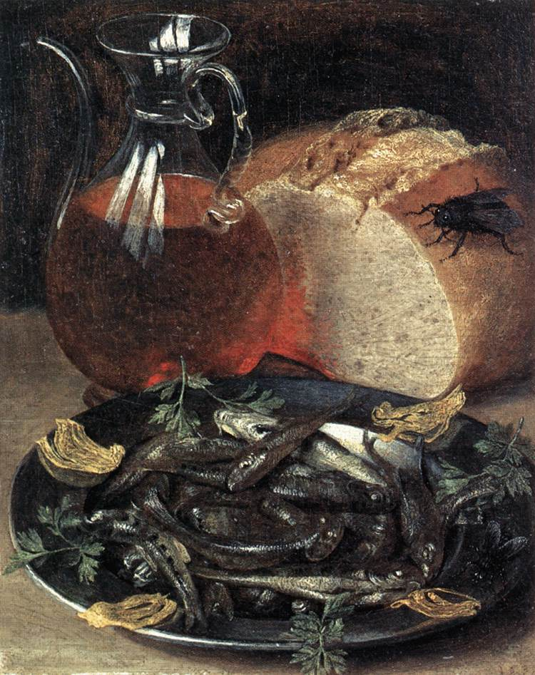
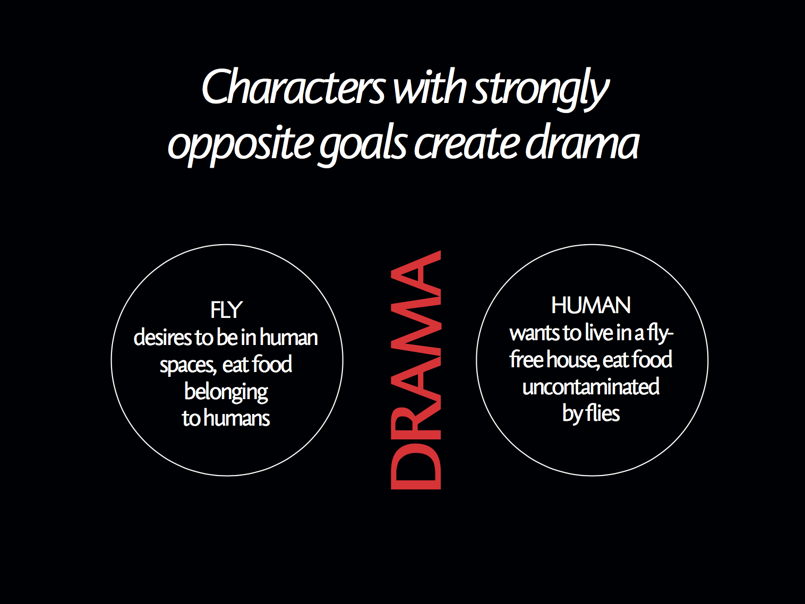
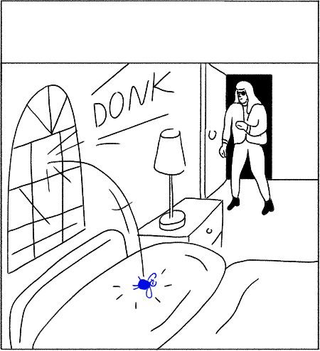

---
# Feel free to add content and custom Front Matter to this file.
# To modify the layout, see https://jekyllrb.com/docs/themes/#overriding-theme-defaults

layout: default-neue

---

# Some notes from the Royal College of Art

Rebecca Cottrell, r.e.cottrell@gmail.com

Here are some notes on my major MA project. The ideas came from my interest in art and computers, and my dissertation (about the role gaps and spaces play in audience imagination). Shout-out to John Cage's [Indeterminacy project](https://en.wikipedia.org/wiki/Indeterminacy_(music)) and David Lynch's comic, [The Angriest Dog in the World](http://www.lynchnet.com/angrydog/). I learned about [Oubapo](https://en.wikipedia.org/wiki/Oubapo) too late for it to be an influence, but my project is very much in the Oubapian spirit.

My project is a comic strip about a fly who dies in every story. Every story is six panels long.

## A fly who dies in every story

First, a note about flies. Flies are pretty disgusting. To paraphrase Steven Connor, they flit indiscriminately from cow pat to pâtisserie. They can taste food with their feet. When I first had the idea of a fly, a friend commented: "Why would anyone care about a fly dying?". I stuck with it anyway, and a tutor later observed that "all cartoon characters *ever* are based on an animal you wouldn't want inside your house".

Flies are interesting because of how closely they live alongside humans. Human societies have attempted to rid themselves of flies and haven't been able to. We're stuck with flies.

In art, flies have been used to symbolise pleasure, decadence, a weakness for alcohol. They often serve a moral lesson about the dangers of enjoying yourself.

*A painting by Georg Flegel. Look at the eyes on that fly.*

The comics are about a fly living in conflict with humans and losing every time. Each story is just six panels, one panel longer than the standard number of acts in a play. They conform to the structure, except when they don't (more on this in a bit). Each story is a minimalist tragicomedy.

The fly itself is nameless, genderless, and likeable. Its personality is poetic, romantic, sensuous. It just wants to enjoy life, often in human spaces. Except it dies in every single story. Even though the fly dies in every single story, it's alive in the next story.

To borrow a phrase Tom Phillips used about Samuel Beckett: "after the boiling of the miserable bowl, there's a hard and irreducible speck of optimism".

## Rules and story physics

The comics are driven by rules. I wrote 8 rules to define aspects of the story and character. *Story physics* is the idea that stories follow natural laws and have a natural, almost unavoidable structure to them. The term was popularised by Andrew Stanton of Pixar.

An idea in story physics is to write characters with strongly opposite goals. This core conflict means it's easy to imagine other parts of the story. Simplified, the fly comics are about the conflict between what a fly wants (to be in human spaces, eat food belonging to humans) versus what a human wants (to live in a house without flies, to eat food uncontaminated by flies).

Story structure is usually defined as between 3 and 5 acts, and the comics are 6 panels long. If each story ends with the death of the fly, each panel is approximately an act. Except I've messed with this a bit: one of the rules is an element of chance, in that the panel in which the fly dies is determined by a die roll. If the fly dies in the second panel, the rest of the comic becomes about the aftermath of the death.  

1. *Six panel stories.*
2. *The fly dies in every story.*
3. *A die roll determines the panel in which the fly dies.*
4. *The fly is relentlessly optimistic despite difficult and threatening circumstances.*
5. *The fly is unaware of his low status and undesirability in human situations.*
6. *Often, a second story is happening in the background.*
7. *The primary voice is the fly, who performs a monologue for the audience.*
8. *After the fly's death, there is silence, though events may still be occurring.*

On story structure: John Yorke's book 'Into the Woods' has been very influential, and [this is a very good lecture he gave at Google](https://www.youtube.com/watch?v=P0UZHUnB5pQ).

Character rules were famously used by master of minimalist storytelling Chuck Jones for [Wile E. Coyote and the Roadrunner](https://www.vox.com/2015/3/5/8157519/chuck-jones-rules-for-roadrunner-coyote).

## Emergent design

I've been obsessed with the idea of evolutionary, emergent and generative ideas in art for a while. My first introduction to generative art was [Conway's Game of Life](https://en.wikipedia.org/wiki/Conway%27s_Game_of_Life), a cellular automaton zero-player game.  Dawkins experimented with simulating evolution in his [biomorphs](https://www.newscientist.com/article/2093366-richard-dawkinss-biomorphs-come-back-to-life/) computer program back in the 1980s. I've struggled for a while with how to integrate this interest into my work.

*Emergent design* is a term I use to describe art and stories that follows rules. Although it has a  computational aspect, I'm interested in humans doing the work rather than computers. It's been hard to find a good definition of what I mean, so this is my personal definition, which is distinct from generative design. It sits within the bigger frame of [systems art](https://en.wikipedia.org/wiki/Systems_art).

Sol LeWitt is an artist who's noted for his wall instructions, writing short specification for wall drawings which were carried out by another human.  Unlike Sol LeWitt, I'm not really interested in exposing the system. I'm interested in systems as a kind of tool for interesting creative results. "The system is the work of art; the visual work of art is the proof of the system. The visual aspect can’t be understood without understanding the system. It isn’t what it looks like but what it is that is of basic importance."  [Here are some JavaScript implementations of Sol's rules.](http://solvingsol.com/solutions/)

A rule is a constraint. I'd argue that constraint is a way of using emergent design, in that it creates dissonance or blocks a creative route you'd normally take, and forces you to take another path. Georges Perec wrote a 300-page novel without the letter 'e': this constraint produced a different outcome that would have occurred otherwise. I had an interesting chat with [my brother](https://erghargh.com/) about this, who said something really clever:

"I think the element of dissonance or stress is key: the feeling of resistance between what the author wants to say and the resistant form, which gives the product a kind of altered-subjective voice, or a different way of seeing."

## Using rules

I've started to think about other comic projects using rules: it could become ridiculous.

* • Every organic shape must include a straight line.
* • Every background scene must show a fruit or vegetable.
* • Every human figure must occupy 75% of the panel.
* • No characters in the story are allowed to look at the camera.
* • No words.
* • The first panel must be the same as the last.

The point is to introduce some friction and resistance to what you would normally do. It imposes on you. It feels uncomfortable. As a result, you do something different.

## Personal learnings for story-writing

* • The stories feed the rules.
* • The rules feed the stories.
* • Give your character a strong goal.
* • Like your character.
* • Your character develops details in the process of emergence.
* • Humans are more complex than computers. We don't understand the brain, and that makes it interesting.

## Come to THE SHOW

Come to [the Royal College of Art School of Communication show](https://www.rca.ac.uk/news-and-events/events/show-2019/), 29 June to 7 July.

