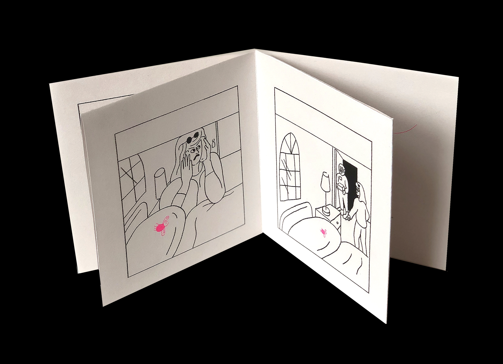
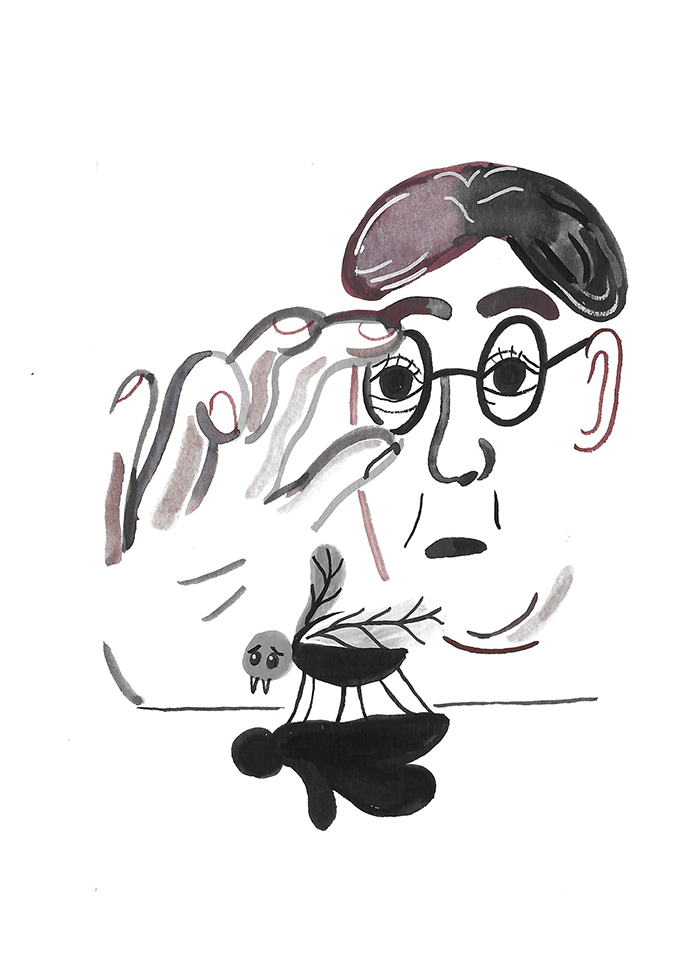

---
# Feel free to add content and custom Front Matter to this file.
# To modify the layout, see https://jekyllrb.com/docs/themes/#overriding-theme-defaults

layout: default-neue

---
[⬅ back](index)

# Repeatedly killing a fly

A series of 10x10cm risograph printed comics based on using rules to write a story. The comics are printed individually as origami books. The comics use a custom typeface I created.

It uses rules to structure the character and narrative, and ideas from story physics. Every story is about the conflict between a fly and the human spaces it inhabits.

[Read more about this project](rca-notes)

  

  

  

  

  

  
