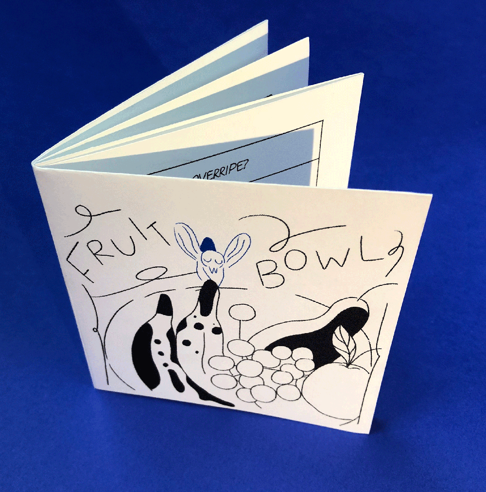
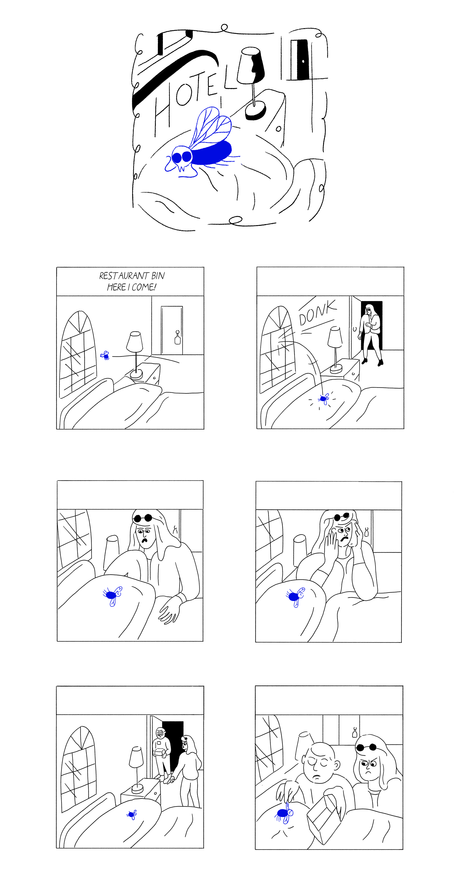
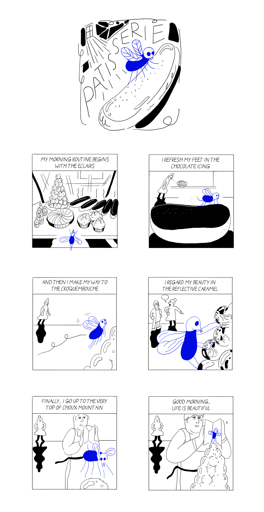
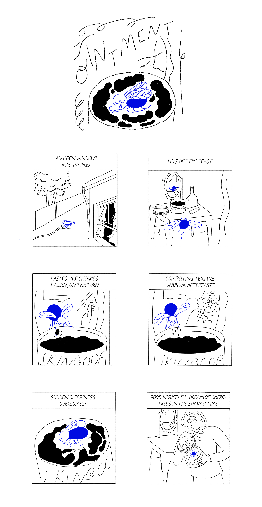
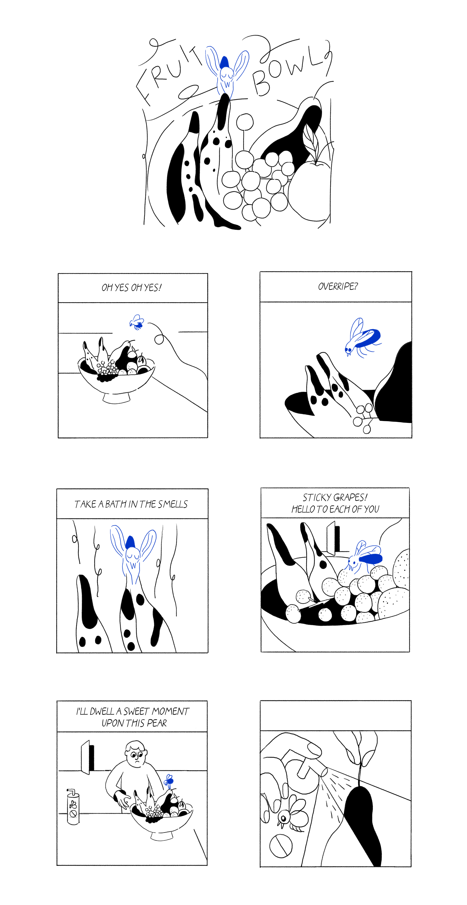
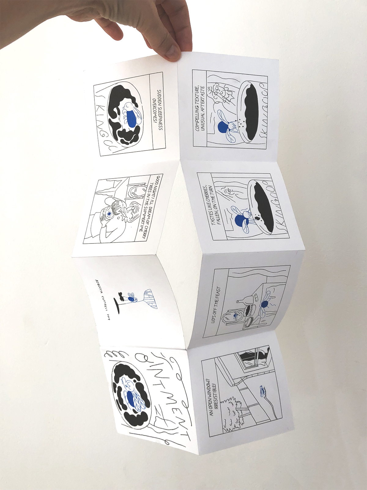
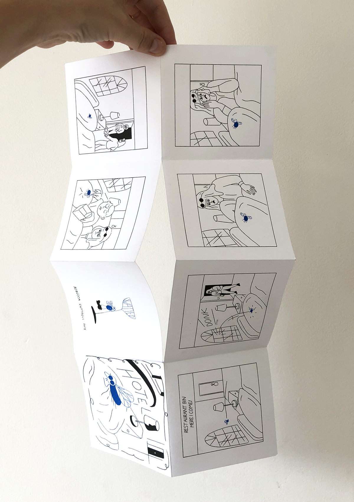
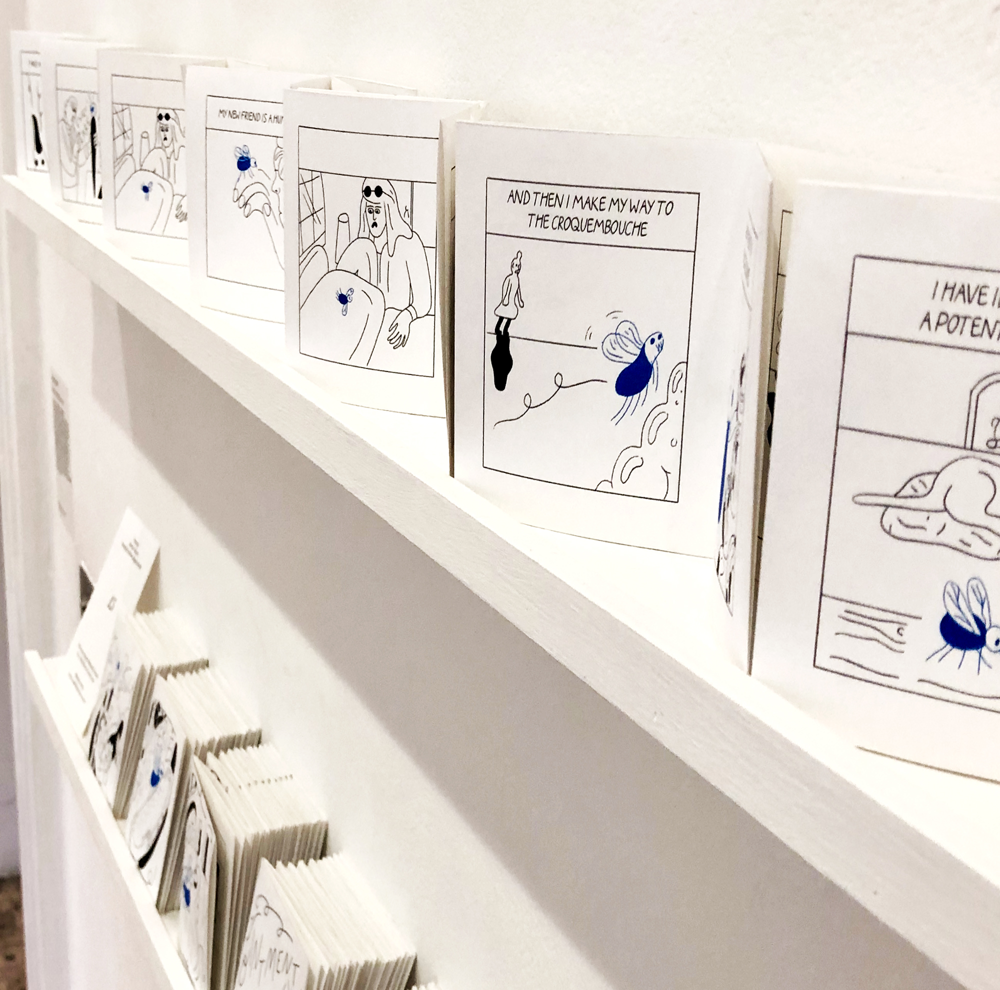

---
# Feel free to add content and custom Front Matter to this file.
# To modify the layout, see https://jekyllrb.com/docs/themes/#overriding-theme-defaults

layout: default-neue
title: Swatted

---
[⬅ back](index)

# Swatted

*Swatted* was my major project at the RCA, and is a series of short comics about a fly who dies in every story. It's an experimental approach to writing and structuring a comic. The stories are composed by following eight rules, and a different story emerges each time. The project takes the form of risograph-printed origami books.

[Further notes on this project](rca-notes)

  

# Rules

1. *Six panel stories.*
2. *The fly dies in every story.*
3. *A die roll determines the panel in which the fly dies.*
4. *The fly is relentlessly optimistic the circumstances.*
5. *The fly is unaware of his low status and undesirability in human situations.*
6. *Often, a second story is happening in the background.*
7. *The primary voice is the fly, who performs a monologue for the audience.*
8. *After the fly's death, there is silence, though events may still be occurring.*

    

    

    

  

  

  
