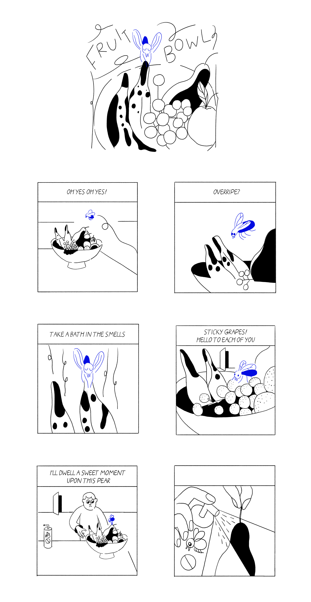

---
# Feel free to add content and custom Front Matter to this file.
# To modify the layout, see https://jekyllrb.com/docs/themes/#overriding-theme-defaults

layout: default-neue
title: Swatted

---
[⬅ back](index)

# Swatted: a minimalist tragicomedy

*Swatted* is a series of very short (six frame) stories about an optimistic fly who dies in every story. There are 7 stories in total.

The stories are composed using 8 narrative rules. Rules shape behaviour and outcome. A gap between rules (the absence of a rule, something that is left undefined) is an opportunity for emergence. An emergent comic strip is a computational approach to authoring a story, where a human plays the role of a computer following a program. In Swatted, each story has the same tragic outcome: the protagonist dies at some point in the six-frame story. An aspect of chance shapes the story: the length of the fly’s life, already very short over a maximum of six panels, is controlled by a dice roll. How the protagonist dies isn’t defined, and a different story emerges each time within the structure of the rules, and from within the spaces. [Further notes on this project](rca-notes)

# The Rules

1. *Six panel stories.*
2. *The fly dies in every story.*
3. *A die roll determines the panel in which the fly dies.*
4. *The fly is relentlessly optimistic despite difficult and threatening circumstances.*
5. *The fly is unaware of his low status and undesirability in human situations.*
6. *Often, a second story is happening in the background.*
7. *The primary voice is the fly, who performs a monologue for the audience.*
8. *After the fly's death, there is silence, though events may still be occurring.*

    

    

    

  

  

  

  
