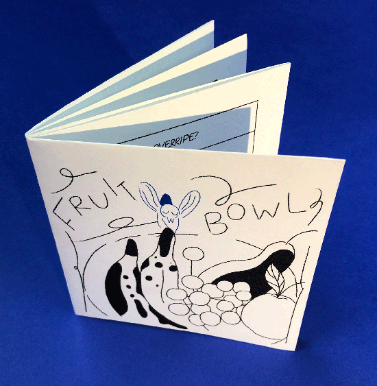

---
# Feel free to add content and custom Front Matter to this file.
# To modify the layout, see https://jekyllrb.com/docs/themes/#overriding-theme-defaults

layout: default-neue
title: Swatted

---
[⬅ back](index)

# Swatted: a minimalist tragicomedy

Rules shape behaviour and outcome. A gap between rules (the absence of a rule, something that is left undefined) is an opportunity for emergence. An emergent comic strip is a computational approach to authoring a story, where a human plays the role of a computer following a program.

An emergent comic strip uses rules to structure and partially define stories. In Swatted, each story has the same tragic outcome: the protagonist dies at some point in the six-frame story. An aspect of chance shapes the story: the length of the fly’s life, already very short over a maximum of six panels, is controlled by a dice roll. How the protagonist dies isn’t defined, and a different story emerges each time within the structure of the rules, and from within the spaces.

Character rules determine how the character responds to the world around it, drama comes from characters with strongly opposite goals. In this case, the conflict is between a fly and the human spaces it inhabits. The tragedy of the stories, in which the fly inevitably dies, is heightened by the joyful, optimistic, and likeable character of the fly.  [Read more about this project](rca-notes)

  

  

  

  

  

  
