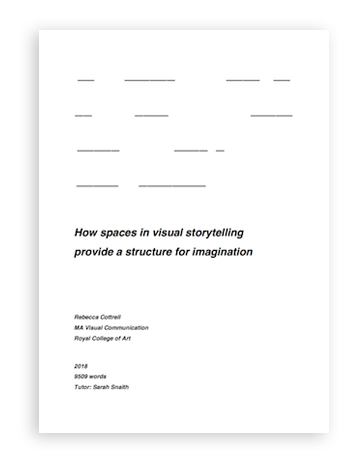

---
# Feel free to add content and custom Front Matter to this file.
# To modify the layout, see https://jekyllrb.com/docs/themes/#overriding-theme-defaults

layout: page

---
# writing

I write some things.

## personal
... 

## academic

[How spaces in visual storytelling provide a structure for imagination](http://rcottrell.com/cottrell_vc_dissertation.pdf) (PDF)  
2018 RCA dissertation awarded Distinction

## design writing

Blog posts for the Government Digital Service:  

2015 [Designing with data(bases)](https://designnotes.blog.gov.uk/2015/03/12/designing-with-databases/)  
2014 [How designers prototype at GDS](https://designnotes.blog.gov.uk/2014/10/13/how-designers-prototype-at-gds/)
